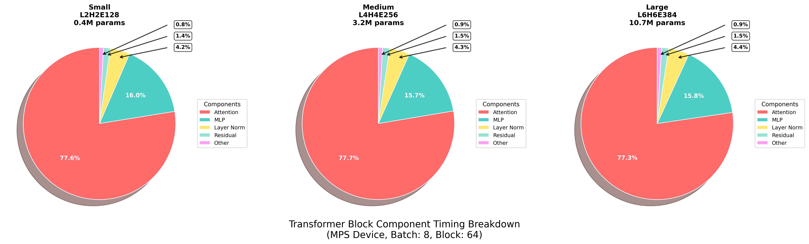
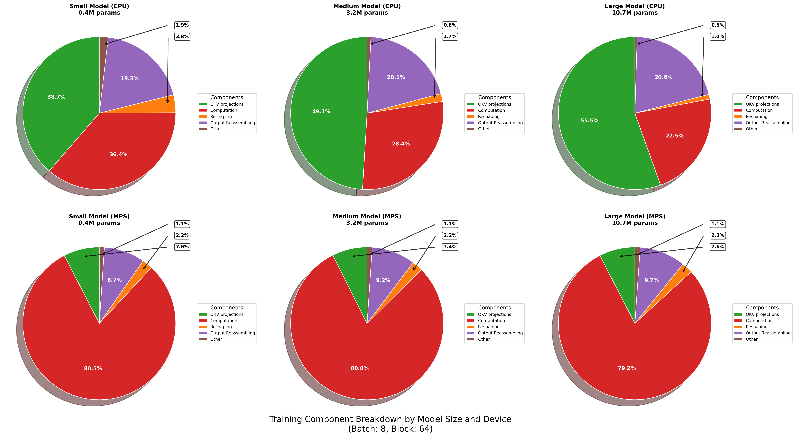
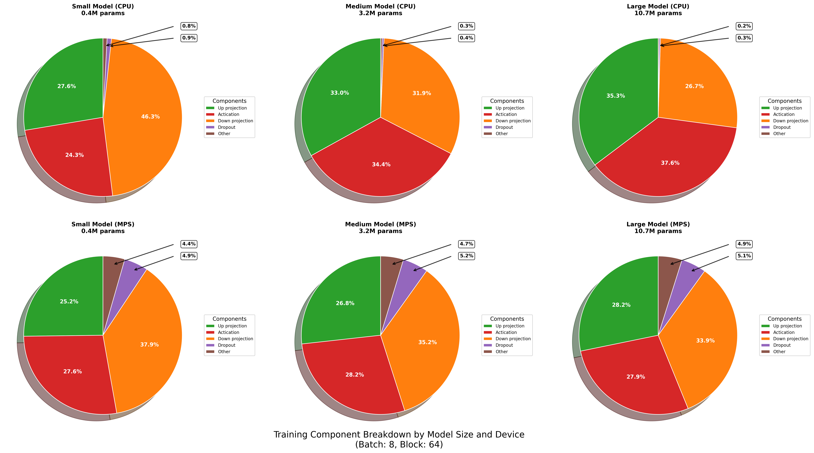
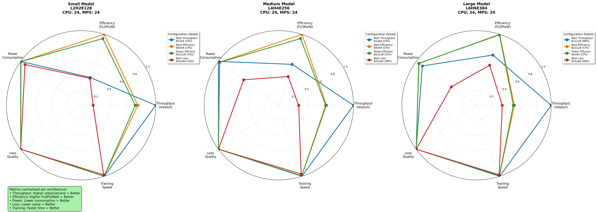
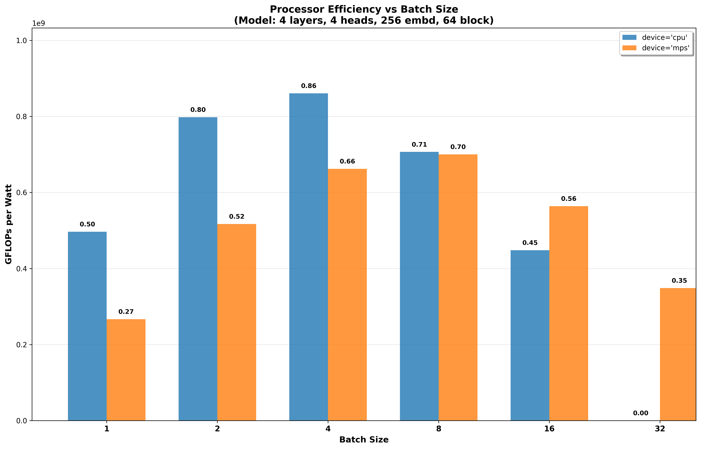

# llmProfiler

---

**Update Nov 2025**  This project is in continuous state and more stages will be added based on my learnings. Check future works for what can be expected.

---

A comprehensive profiling and analysis toolkit built on top of Andrej Karpathy's [nanoGPT](https://github.com/karpathy/nanoGPT). This extension adds detailed performance profiling, power measurement, and efficiency analysis for transformer model training across different hardware configurations. 



Because the code is so simple, it is very easy to hack to your needs, train and profile new models from scratch.

## quick start
Install the requirements.txt file. The fastest way to get started is to train a character-level GPT on the works of Shakespeare. First, we download it as a single (1MB) file and turn it from raw text into one large stream of integers:

```sh
python data/shakespeare_char/prepare.py
```

This creates a `train.bin` and `val.bin` in that data directory. Now it is time to train your GPT. The size of it very much depends on the computational resources of your system:

**I only have a macbook** (or other cheap computer). No worries, this entire profiling of training a GPT is done on the macbook so I dialed the configuration down a notch. I recommend checking out the `quick_test.yaml` file in `config/profiling` folder to customise the model configuration. But even without that, a simple train run could look as follows:

```sh
sudo echo 'ready'
```
Once authenticted run this:
```sh
make quick-test plots
```

Here, based on whether we are running on CPU or GPU of Apple Silicon Macbooks we must set `--device=cpu` or `--device=mps` (short for "Metal Performance Shaders"); PyTorch then uses the on-chip GPU that can *significantly* accelerate training (2-3X) and allow you to use larger networks. Also turn off PyTorch 2.0 compile with `--compile=False`. 

Then when we evaluate we get a bit more noisy but faster estimate (`--eval_iters=20`, down from 200), our context size is only 64 characters instead of 256, and the batch size only 8 examples per iteration, not 64. We'll also use a much smaller Transformer (4 layers, 4 heads, 128 embedding size), and decrease the number of iterations to 2000 (and correspondingly usually decay the learning rate to around max_iters with `--lr_decay_iters`). Because our network is so small we also ease down on regularization (`--dropout=0.0`). This still runs in about ~3 minutes, but gets us a loss of only 2.51 and therefore also worse samples, but it's still good fun:

Not bad for ~3 minutes on a CPU, for a hint of the right character gestalt. If you're willing to wait longer, feel free to tune the hyperparameters, increase the size of the network, the context length (`--block_size`), the length of training, etc.

## reproducing profiling results

To reproduce the exact results as in the results folder you might want to run the following command but do ensure `sudo echo 'ready'` is run again before running:

```sh
make full-profile plots
```

This will run for about 2 hours using PyTorch.

## plots
The timing breakdown for the transformer block is depicted below. We can notice that the causal self attention mechanism and multi-layer perceptron (MLPs) takes majority of the compute time irrespective of the model size


Now lets look at the attention block breakdown first. Since we are running only sub-parameter models [0.4 to 10M] for only 200 iterations its only understandable that the CPU overhead for the QKV projections is larger when computing on the core. On the other hand, when run on the M4 GPU, we can notice that the core computation, the stencil clearly takes over as expected, making GPUs faster.


Now lets look at the MLP layers breakdown. Again, irrespective of the model and device the upward and downard projections and the activation layer take up majority of the time almost always in that order.


Now lets look at this rarad plot which shows for each of the sub-parameter configurations, which batch size and block size pairs ended up with the best loss, throughput and power efficiency. We notice that for bigger models, the M4 GPU alomsyt always gets the best (least) loss and the CPU models the best power and energy efficient. This is expected but confirmed now that although CPUs are more efficient in energy, but not leading to the lest loss within similar training times and iterations.


Now lets look at the computaitonal energy efficiency metric FLOPs/watt, which is ideal to optimise. The trend shows that for mdeium batch sizes we attain better computaitonal energy efficiency is seen in the plot which is something I'm yet to understand why and will include in the future works.


**Note:**  There are several other trends plotted which can be checked in the results folder. To keep the readMe compact only a few are shown here.

## future works
- Investigate and understand why medium batch sizes get better FLOPs/watt
- Profile fine-tuning and inference
- run bigger models on cluster to profile